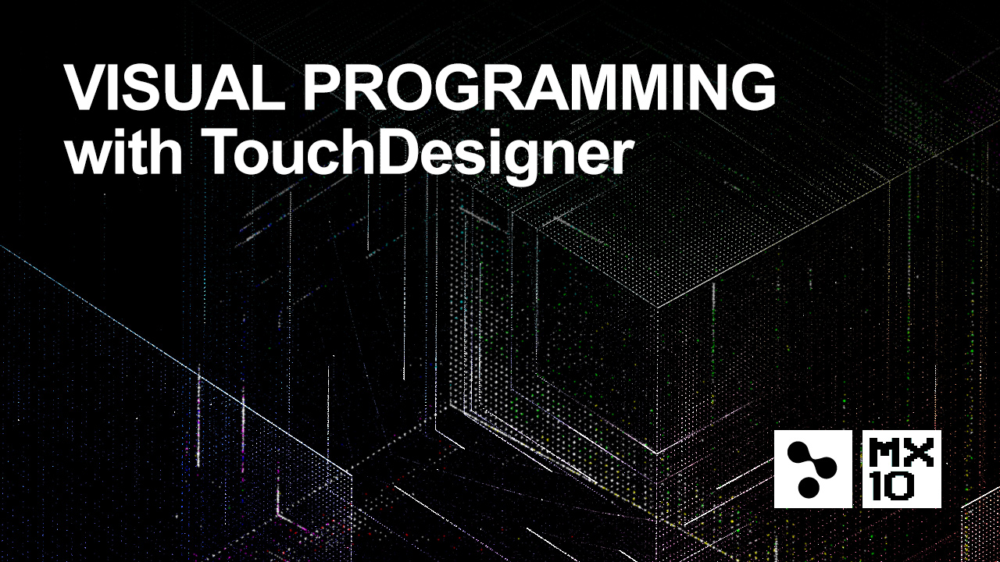

# TD_WRSHP_VP_Berlin_9-19
 

Introduction to Visual Programming with TouchDesigner

In this 2-day workshop – held in English - media artist Stefan Kraus introduces participants to the powerful visual development platform and present best practices for its use it in media installations, video projections and live performances. The course introduces artists, performers and designers to the mutilmedia authoring environment TouchDesigner. TD is a node based visual programming language, that was specifically designed to enable artists to create interactive programs without having to write a single line of code. This allows users to experiment with cutting edge technology, prototype interaction and explore the possibilities of digital creation.

The course combines a general introduction to node based programming with hands-on exercises.

In this workshop you will understand:

How to get started with Touchdesigner
How to create interactive and audioreactive 3D animations
How to turn data into visualisations
How to synchronise video/audio on multiple screens / projectors
How to control lights and LEDs through Artnet and DMX
How to perform your AV creations through MIDI and OSC
How to create custom interfaces

Requirements : Laptop with a 3-button mouse
The latest release of TouchDesigner099 installed
Participants are welcome to bring their own MIDI devices

